<p align="center">
  
</p>

# Vaultline

<p align="center">
  <a href="README.md"></a>
  <a href="README.es.md"></a>
  <a href="README.fr.md"></a>
  <a href="README.de.md"></a>
  <a href="README.pt-BR.md"></a>
  <a href="README.zh-CN.md"></a>
  <a href="README.ja.md"></a>
  <a href="README.ko.md"></a>
  <a href="README.it.md"></a>
  <a href="README.ar.md"></a>
</p>

<p align="center">
  <a href="https://dacameragirl.github.io/Vaultline/"></a>
  <a href="https://dacameragirl.github.io/links/"></a>
  
  
  
  
</p>

**Gouvernance des médias d'entraînement IA** — provenance, contrôle qualité, conformité et versions immuables pour les données d'entraînement voix et vidéo.

Prouvez ce qui est entré dans le modèle : chaque clip tracé, validé par QC et prêt pour la release.

> **Statut :** le site marketing est en ligne sur GitHub Pages. La **plateforme complète** (API + console + ingestion) s'exécute localement via le raccourci Bureau ou se déploie avec [DEPLOY.md](./DEPLOY.md).

## Dépôt vs. site en ligne

| Quoi | URL |
|---|---|
| **Dépôt GitHub** | [github.com/DaCameraGirl/Vaultline](https://github.com/DaCameraGirl/Vaultline) |
| **Marketing / landing** (GitHub Pages) | [dacameragirl.github.io/Vaultline](https://dacameragirl.github.io/Vaultline/) |
| **Plateforme complète** (API + console + ingestion) | Raccourci Bureau ou [DEPLOY.md](./DEPLOY.md) |
| **Hub projets** | [dacameragirl.github.io/links](https://dacameragirl.github.io/links/) |

GitHub affiche ce README. Mettez en favori le **site en ligne** pour l'URL marketing — il est distinct de la page du dépôt.

## Points forts

| Couche | Rôle |
|---|---|
| **API entreprise** | FastAPI — ingestion, upload, QC, conformité, releases, export d'audit |
| **Site marketing** | UI produit en direct sur `/site/index.html` quand l'API tourne |
| **Console ops** | Tableau de bord sur `/console/index.html` — actifs, lignée, actions |
| **CLI** | `bench.py` pour les opérations du pipeline |
| **Catalogue** | Registre SQLite provenance + QC + releases |
| **Go-to-market** | `leads/target-accounts.csv`, `marketing/one-pager.md`, modèles d'outreach |
| **Docker** | `docker compose up` pour un déploiement type production |
| **Render** | Blueprint `render.yaml` pour l'API hébergée |

## Lancer en local (plateforme complète)

**Le plus simple — double-clic sur `Vaultline` sur le Bureau.**

Configuration initiale :

```powershell
powershell -File setup/create-desktop-shortcut.ps1
```

Ou :

```powershell
setup\Launch Vaultline.bat
```

**URLs lorsque le serveur tourne :**

| Surface | URL |
|---|---|
| Marketing + API live | http://localhost:8470/site/index.html |
| Console | http://localhost:8470/console/index.html |
| Docs API | http://localhost:8470/docs |

Tout vérifier :

```powershell
powershell -File setup/verify.ps1
```

Arrêter :

```powershell
powershell -File setup/stop-vaultline.ps1
```

## Qui achète

| Segment | Problème |
|---|---|
| IA vocale (ASR/TTS) | Audits consentement + QC avant livraison du modèle |
| Labs vidéo / multimodaux | Jeux de données benchmark avec lignée traçable |
| Fournisseurs IA entreprise | Questionnaires achats sur la gouvernance des données |

**Acheteur :** VP Engineering · Head of ML Data · Director AI Compliance

## Commercialiser

1. Ouvrir `leads/target-accounts.csv`
2. Utiliser les modèles dans `marketing/outreach-templates.md`
3. Partager le lien live : marketing Pages + console hébergée ou démo locale
4. Joindre `marketing/one-pager.md` lors des appels entreprise

Voir `marketing/CAMPAIGN.md` pour le plan sur 30 jours.

## Référence rapide API

```http
GET  /health
GET  /v1/dashboard
GET  /v1/assets
POST /v1/uploads
POST /v1/ingest
POST /v1/releases
GET  /v1/audit/export
```

## Déployer en production

Voir **[DEPLOY.md](./DEPLOY.md)** — GitHub Pages (marketing), Render (API) ou Docker.

## Structure du projet

```text
Vaultline/
├── api/server.py           API entreprise
├── marketing/              Landing + copy GTM (source déploiement Pages)
├── console/                Tableau de bord ops
├── leads/                  Comptes cibles
├── workbench/              Catalogue, QC, ingestion, export
├── catalog/                Registre SQLite (local, gitignored)
├── releases/               Bundles de données immuables
├── docs/assets/            SVG hero README
└── config/enterprise.yaml  Config produit
```

## Contributeurs

- **Angela Hudson** ([DaCameraGirl](https://github.com/DaCameraGirl)) — direction produit, GTM, tests
- **Claude** — échafaudage plateforme, API, console, marketing, kit de déploiement

## Licence

© 2026 Angela Hudson (DaCameraGirl). Voir [LICENSE](./LICENSE).