<p align="center">
  
</p>

<p align="center">
  <strong>AI training media governance — provenance, QC, compliance, and releases for voice/video training data.</strong>
</p>

<p align="center">
  <a href="https://dacameragirl.github.io/Vaultline/"></a>
  <a href="https://github.com/DaCameraGirl/Vaultline"></a>
</p>

<p align="center">
  
  
</p>

### Languages

<p align="center">
  
  
  
</p>

### Stack

<p align="center">
  
  
</p>

<p align="center">
  Built by <strong>Angela Hudson</strong> · <a href="https://github.com/DaCameraGirl">DaCameraGirl</a>
</p>
# Vaultline

<p align="center">
  <a href="README.md"></a>
  <a href="README.es.md"></a>
  <a href="README.fr.md"></a>
  <a href="README.de.md"></a>
  <a href="README.pt-BR.md"></a>
  <a href="README.zh-CN.md"></a>
  <a href="README.ja.md"></a>
  <a href="README.ko.md"></a>
  <a href="README.it.md"></a>
  <a href="README.ar.md"></a>
</p>

<p align="center">
  <a href="https://dacameragirl.github.io/Vaultline/"></a>
  <a href="https://dacameragirl.github.io/links/"></a>
  
  
  
  
</p>

**AI training media governance** — provenance, QC, compliance, and immutable releases for voice and video training data.

Prove what went into the model: every clip traced, QC-gated, and release-ready.

> **Status:** marketing site is live on GitHub Pages. The **full platform** (API + console + ingest) runs locally via Desktop shortcut or deploys with [DEPLOY.md](./DEPLOY.md).

<p align="center"></p>
<p align="center"></p>


| What | URL |
|---|---|
| **GitHub repo** | [github.com/DaCameraGirl/Vaultline](https://github.com/DaCameraGirl/Vaultline) |
| **Marketing / landing** (GitHub Pages) | [dacameragirl.github.io/Vaultline](https://dacameragirl.github.io/Vaultline/) |
| **Full platform** (API + console + ingest) | Desktop shortcut or [DEPLOY.md](./DEPLOY.md) |
| **Project hub** | [dacameragirl.github.io/links](https://dacameragirl.github.io/links/) |

GitHub shows this README. Bookmark the **live site** for the marketing URL — it's separate from the repo page.

<p align="center"></p>
<p align="center"></p>


| Layer | What it does |
|---|---|
| **Enterprise API** | FastAPI — ingest, upload, QC, compliance, releases, audit export |
| **Marketing site** | Live product UI at `/site/index.html` when the API is running |
| **Ops console** | Dashboard at `/console/index.html` — assets, lineage, actions |
| **CLI** | `bench.py` for pipeline operations |
| **Catalog** | SQLite provenance + QC + release registry |
| **Go-to-market** | `leads/target-accounts.csv`, `marketing/one-pager.md`, outreach templates |
| **Docker** | `docker compose up` for production-style deploy |
| **Render** | `render.yaml` blueprint for hosted API |

<p align="center"></p>
<p align="center"></p>


**Easiest — double-click `Vaultline` on your Desktop.**

First-time setup:

```powershell
powershell -File setup/create-desktop-shortcut.ps1
```

Or:

```powershell
setup\Launch Vaultline.bat
```

**URLs when the server is running:**

| Surface | URL |
|---|---|
| Marketing + live API | http://localhost:8470/site/index.html |
| Console | http://localhost:8470/console/index.html |
| API docs | http://localhost:8470/docs |

Verify everything:

```powershell
powershell -File setup/verify.ps1
```

Stop:

```powershell
powershell -File setup/stop-vaultline.ps1
```

<p align="center"></p>
<p align="center"></p>


| Segment | Pain |
|---|---|
| Voice AI (ASR/TTS) | Consent + QC audits before model ship |
| Video / multimodal labs | Benchmark datasets with traceable lineage |
| Enterprise AI vendors | Procurement questionnaires on data governance |

**Buyer:** VP Engineering · Head of ML Data · Director AI Compliance

<p align="center"></p>
<p align="center"></p>


1. Open `leads/target-accounts.csv`
2. Use templates in `marketing/outreach-templates.md`
3. Share live link: Pages marketing + hosted or local console demo
4. Attach `marketing/one-pager.md` on enterprise calls

See `marketing/CAMPAIGN.md` for the 30-day plan.

<p align="center"></p>
<p align="center"></p>


```http
GET  /health
GET  /v1/dashboard
GET  /v1/assets
POST /v1/uploads
POST /v1/ingest
POST /v1/releases
GET  /v1/audit/export
```

<p align="center"></p>
<p align="center"></p>


See **[DEPLOY.md](./DEPLOY.md)** — GitHub Pages (marketing), Render (API), or Docker.

<p align="center"></p>
<p align="center"></p>


```text
Vaultline/
├── api/server.py           Enterprise API
├── marketing/              Landing + GTM copy (Pages deploy source)
├── console/                Ops dashboard
├── leads/                  Target accounts
├── workbench/              Catalog, QC, ingest, export
├── catalog/                SQLite registry (local, gitignored)
├── releases/               Immutable dataset bundles
├── docs/assets/            README hero SVG
└── config/enterprise.yaml  Product config
```

<p align="center"></p>
<p align="center"></p>


- **Angela Hudson** ([DaCameraGirl](https://github.com/DaCameraGirl)) — product direction, GTM, testing
- **Claude** — platform scaffold, API, console, marketing, deploy kit

<p align="center"></p>
<p align="center"></p>


© 2026 Angela Hudson (DaCameraGirl). See [LICENSE](./LICENSE).